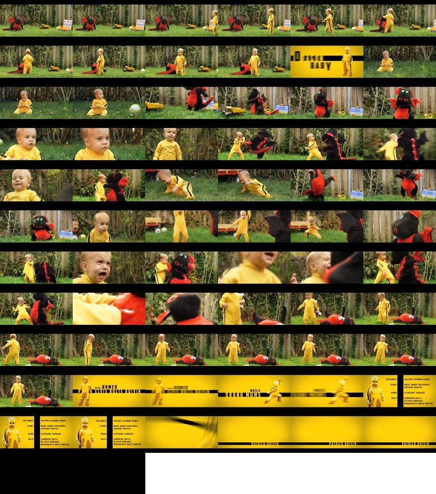

# motivation

Can be used to fetch frames from a video and create
mosaics out of them for better storage and distribution.

Possible usage scenarios:

* show preview in video slider
* auxiliary imagery for non linear editing of videos


# requirements

* Requires graphicsmagick to be installed:

    sudo apt-get install graphicsmagick

* Requires avconv to be installed with x264 support (if reading h.264 videos)
Read how to do it [here](INSTALL.md).


# examples

The following examples are available in [samples](samples)

And the video used it them is this one:

[  ](http://videos.sapo.pt/jTE4TOJANeatDmQi341m)


## do mosaic magic

Source code:

```javascript
var au = require('avconv-utils');
au.doMosaicMagic(
  {
    video:    'jTE4TOJANeatDmQi341m.mp4',
    scale:    0.25,
    fps:      1,
    strategy: 'square',
    mosaic:   'mosaics/jTE4TOJANeatDmQi341m.jpg'
  },
  function(err, res) {
    if (err) { throw (err); }
    console.log(res);
  }
);
```

Callback result is:

```javascript
{
  mosaicDimensions: [870, 984],
  frameDimensions:  [145, 82],
  strategy:         'square',
  outFile:          'mosaics/jTE4TOJANeatDmQi341m.jpg',
  grid:             [6, 12],
  n:                68,
  videoDuration:    66.41,
  videoDimensions:  [580, 326]
}
```

and the following mosaic image:



**Note**: The `square` strategy displayed above is the most appropriate for humans to inspect the result. 
If you're scripting a preview slider based on CSS properties `horizontal` or `vertical` strategies
are better suited for such purpose. They compose the mosaic in a single row/column respectively.


## get metadata

Source code:

```javascript
var au = require('../lib/avconv-utils');
au.getMetadata(
  'jTE4TOJANeatDmQi341m.mp4',
  function(err, res) {
    if (err) { throw (err); }
    console.log(res);
  }
);
```


Callback result is:

```javascript
{
  duration:     '00:01:06.41',
  durationSecs: 66.41,
  vCodec:       'h264 (Constrained Baseline)',
  vDetails:     'Video: h264 (Constrained Baseline), yuv420p, 580x326 [PAR 1:1 DAR 290:163], 694 kb/s, 24 fps, 24 tbr, 24 tbn, 48 tbc',
  dimensions:   [580, 326],
  aCodec:       'aac',
  aDetails:     'Audio: aac, 48000 Hz, stereo, s16, 127 kb/s'
}
```


# API

Check [API](api.md).

Usage examples in bin/run command line utility and tests directory.
